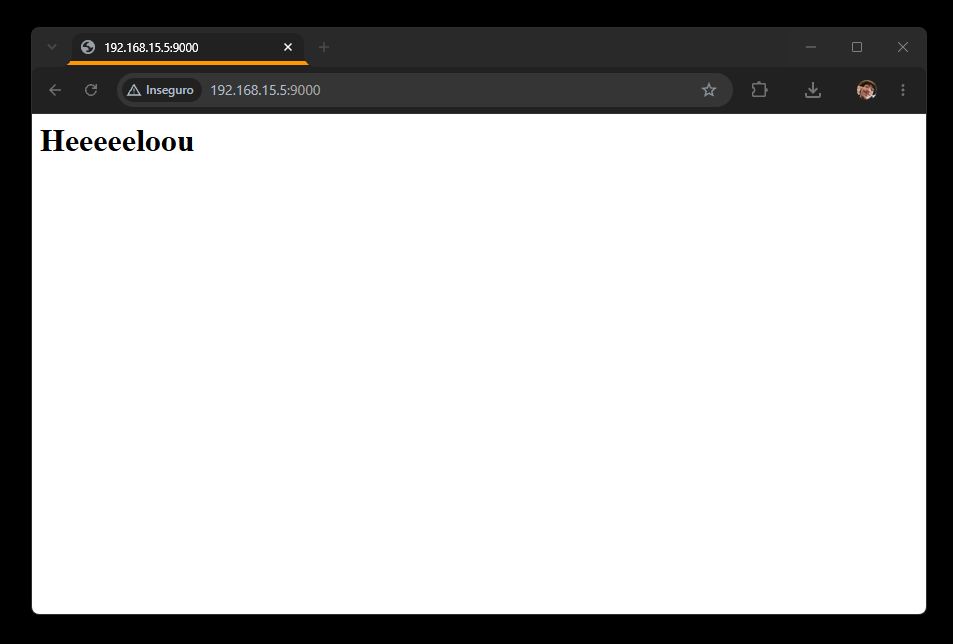

# 01 — O início do Nono Orbe

Hoje começa o **Nono Orbe**, um projeto de código aberto para organização pessoal.

Minha rotina é formada por diferentes projetos, ferramentas e informações espalhadas entre vários navegadores. Com o tempo, até encontrar o lugar certo para começar uma tarefa passou a fazer parte do trabalho.

A primeira ideia foi simples: criar uma página personalizada, executada localmente e aberta junto com o navegador.

Um ponto de partida para reunir meus acessos, organizar contextos e chegar mais rápido ao que realmente importa.

Este primeiro teste ainda não tinha painel, banco de dados ou inteligência artificial. Era apenas uma página em branco dizendo “olá”. Mesmo assim, ela já representava o começo de algo maior: um ambiente pessoal, aberto e programável, construído a partir da forma como organizo meu próprio mundo digital.

O projeto está disponível em:

<https://github.com/SrMahal/nono-orbe>

